<br>
#*Deeplearning*
##from zero to hero

####Gianluca Carucci | @rucka | gianluca.carucci.org

<br>
###### slides & code __*https://github.com/rucka/pycon9*__


---
##*what I do*
###Software Engineer **|** Agile coach
###@Hyperfair inc

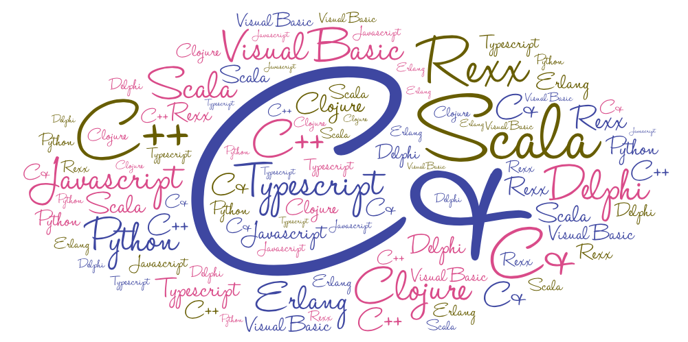

---

## *communities*
### Ugidotnet **|** Scala Milano Meetup


---

#how we meet


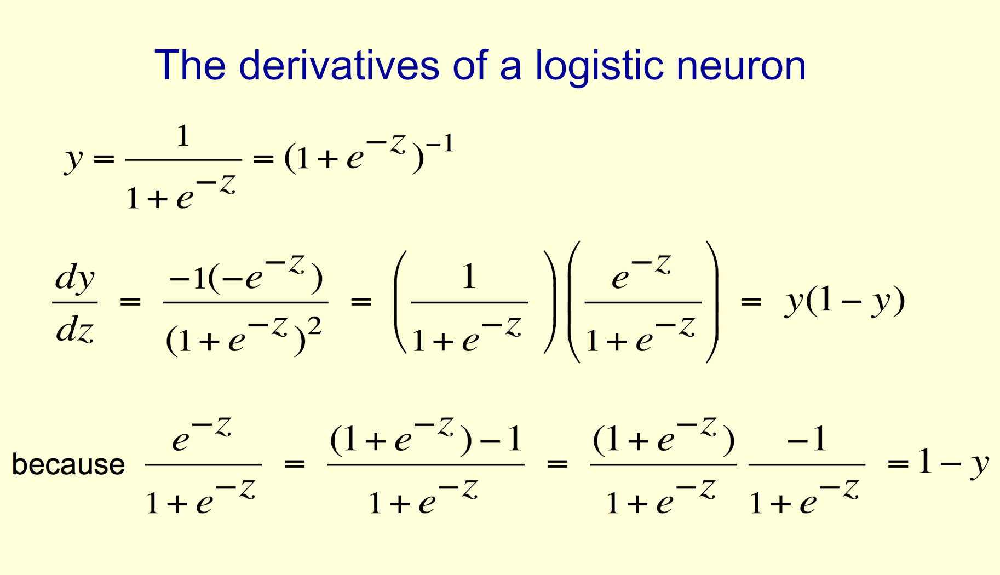

---

#not a good start


---

#is there another way?


---

#goal


---

#look mum, no code!


 
---

# transfer learning[^1]

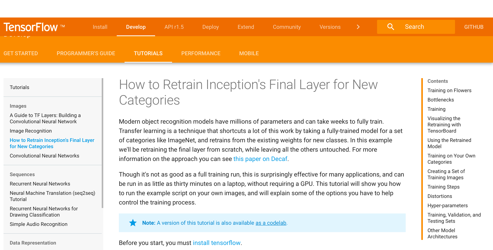

[^1]: 
- [How to Retrain Inception's Final Layer for New Categories](https://www.tensorflow.org/tutorials/image_retraining) 
- [TensorFlow for Poets](https://codelabs.developers.google.com/codelabs/tensorflow-for-poets/#0)

 ---

#the simpsons detector

```bash
root@cc5a496bf40e:/code/simpson_retraining# ./retrain.sh 
INFO:tensorflow:Looking for images in 'marge'
INFO:tensorflow:Looking for images in 'homer'
INFO:tensorflow:Looking for images in 'bart'
INFO:tensorflow:Looking for images in 'lisa'
....
INFO:tensorflow:2018-02-25 09:26:27.689515: Step 0: Train accuracy = 53.0%
INFO:tensorflow:2018-02-25 09:26:27.689750: Step 0: Cross entropy = 1.367082
INFO:tensorflow:2018-02-25 09:26:28.583996: Step 0: Validation accuracy = 33.0% (N=100)
....
INFO:tensorflow:2018-02-25 09:26:49.359180: Step 30: Train accuracy = 65.0%
INFO:tensorflow:2018-02-25 09:26:49.359404: Step 30: Cross entropy = 1.172318
INFO:tensorflow:2018-02-25 09:26:49.871993: Step 30: Validation accuracy = 69.0% (N=100)
....
INFO:tensorflow:2018-02-25 09:35:37.061001: Step 1000: Train accuracy = 95.0%
INFO:tensorflow:2018-02-25 09:35:37.061221: Step 1000: Cross entropy = 0.311776
INFO:tensorflow:2018-02-25 09:35:37.600067: Step 1000: Validation accuracy = 87.0% (N=100)
....
INFO:tensorflow:2018-02-25 09:44:03.139348: Step 2000: Train accuracy = 95.0%
INFO:tensorflow:2018-02-25 09:44:03.139593: Step 2000: Cross entropy = 0.286085
INFO:tensorflow:2018-02-25 09:44:03.538799: Step 2000: Validation accuracy = 83.0% (N=100)
....
INFO:tensorflow:2018-02-25 10:00:39.674607: Step 3999: Train accuracy = 97.0%
INFO:tensorflow:2018-02-25 10:00:39.674859: Step 3999: Cross entropy = 0.175444
INFO:tensorflow:2018-02-25 10:00:40.073648: Step 3999: Validation accuracy = 90.0% (N=100)
INFO:tensorflow:Final test accuracy = 90.4% (N=261)
```

```bash
root:/code/simpson_retraining# ./evaluate.sh /data/simpson/test_set/0.jpg`
bart 0.63594097
marge 0.3191907
lisa 0.034744244
homer 0.010124116
```

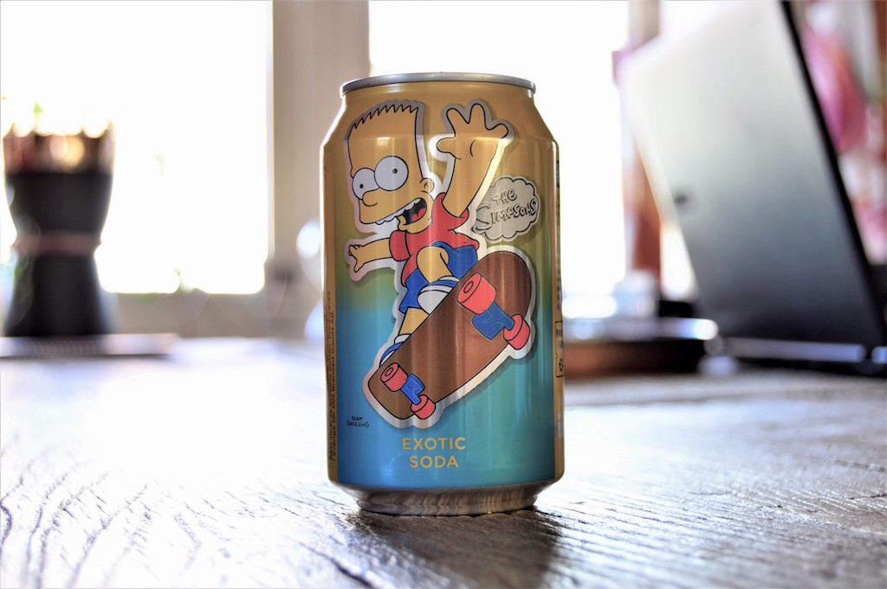

---

#common scenarios

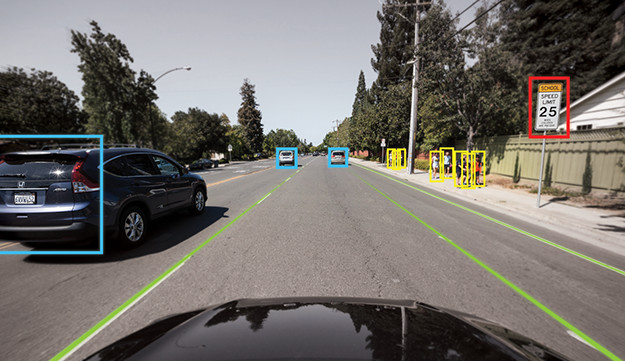


---

#common solutions 
##ready to go models[^2]

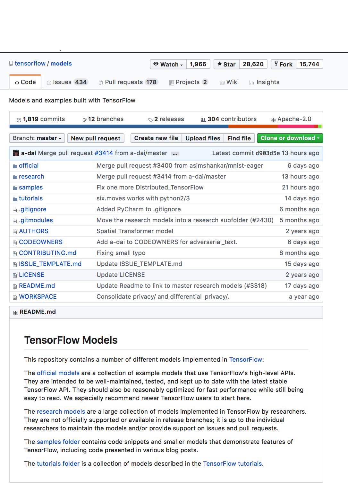
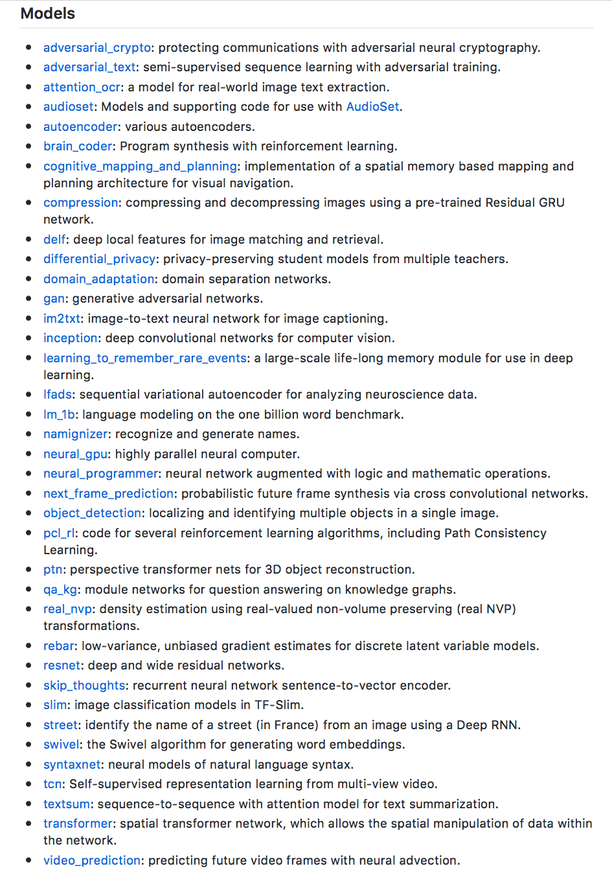

[^2]: [TensorFlow models](https://github.com/tensorflow/models/)

---

#common solutions 
##ready to go libraries[^3]

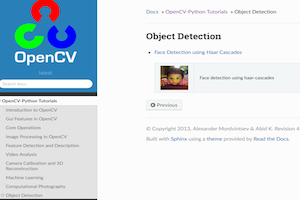

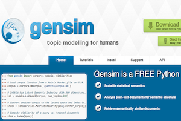

[^3]: 
- [OpenCV-Python](https://opencv-python-tutroals.readthedocs.io/en/latest/index.html)
- [Spacy](https://spacy.io)
- [gensim](https://https://radimrehurek.com/gensim/index.html)

---
##Word Algebra[^4]

```python
from gensim.models.KeyedVectors import load_word2vec_format

model = load_word2vec_format(
    'GoogleNews-vectors-negative300.bin',
    limit=2000000, binary=True)

#calculate: (Rome - Italy) + France = ?
model.similar_by_vector(
    model['Rome'] - model['Italy'] + model['France']
    , topn=1)
#[(u'Paris', 0.7167540192604065)]

#calculate: (doctor - man) + woman = ?
model.most_similar(
    model['doctor'] - model['man'] + model['woman']
    , topn=1)
#[(u'nurse', 0.7127888798713684)]

#calculate: (gone - go) + eat = ?
model.most_similar(
    positive=['gone', 'eat'], negative=['go']
    , topn=1)
#[(u'eaten', 0.7462186217308044)]
```


[^4]: Credits: [The dark side of deep learning - Simone Scardapane - Codemotion 2017](https://www.youtube.com/watch?v=fs6cLWQYr_I) 

---

#common solutions 
##ready to go dataset[^5]

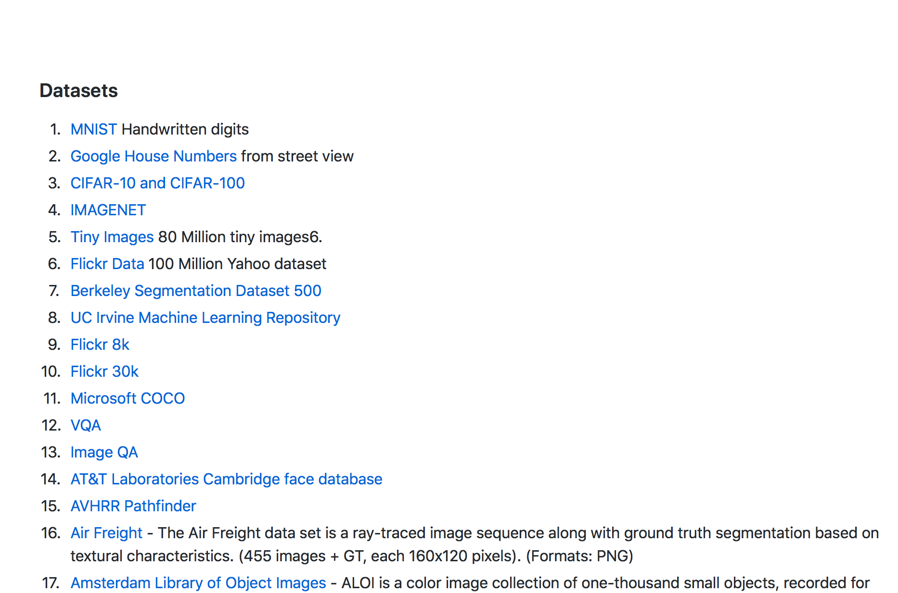

[^5]: 
- [Awesome deep learning#datasets (Github)](https://github.com/ChristosChristofidis/awesome-deep-learning#datasets)
- [List of datasets for machine learning research (Wikipedia)](https://en.wikipedia.org/wiki/List_of_datasets_for_machine_learning_research)
- [Deep Learning datasets](http://deeplearning.net/datasets/)

---

#what else?


---

#ingredients
###_keras_
###_tensorflow_


---

#deep learning in *5* steps


---

#1. define the problem
###_regression_
###_classification_

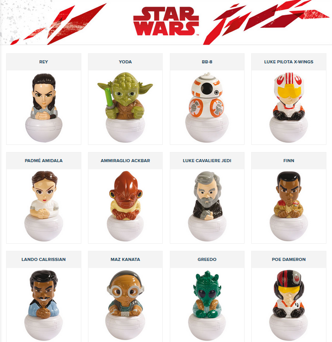

---

#2. prepare your data
###_choose/create dataset_
###_clean data_
###_normalize data_


---

#3. define the model 
###_multilayer perception (MLP)_ -> it's simple
###_convolutional neural network (CNN)_ -> image processing/video analysis
###_long short-term memory (LSTM)_ -> next sequence prediction
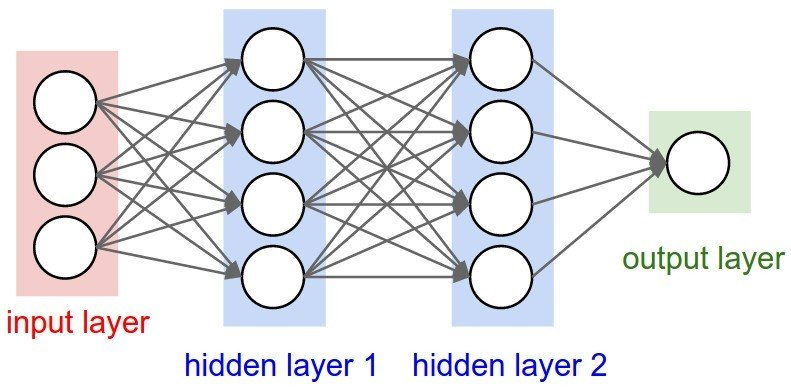


---

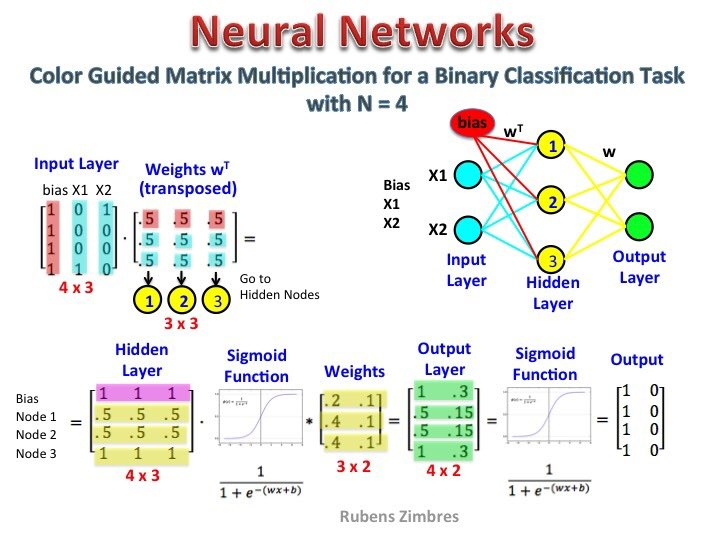

---

#4. train and evaluate
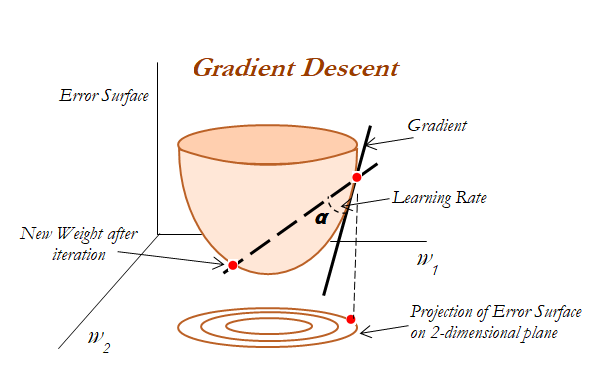

---

#5. refine the model
####_add layers_
####_change model architecture_
####_enhance your data_


---

#**tip I**: 
###_your dataset is the key_


---

#**tip II**: 
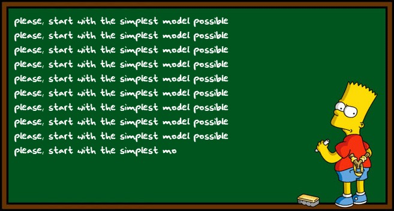
 
---

#**tip III**: 
###you should trust the graph


---

#**tip IV**: 
###_patient_


---

#bonus track: hyperparameters tuning[^6]
###_scikit learn GridSearchCV, RandomizedSearchCV_
###_hyperopt_


[^6]:
- [scikit learn Exhaustive&Random Grid Search](http://scikit-learn.org/stable/modules/grid_search.html)
- [Hyperopt](http://hyperopt.github.io/hyperopt/)


---

#troubleshooting


---

###overfitting
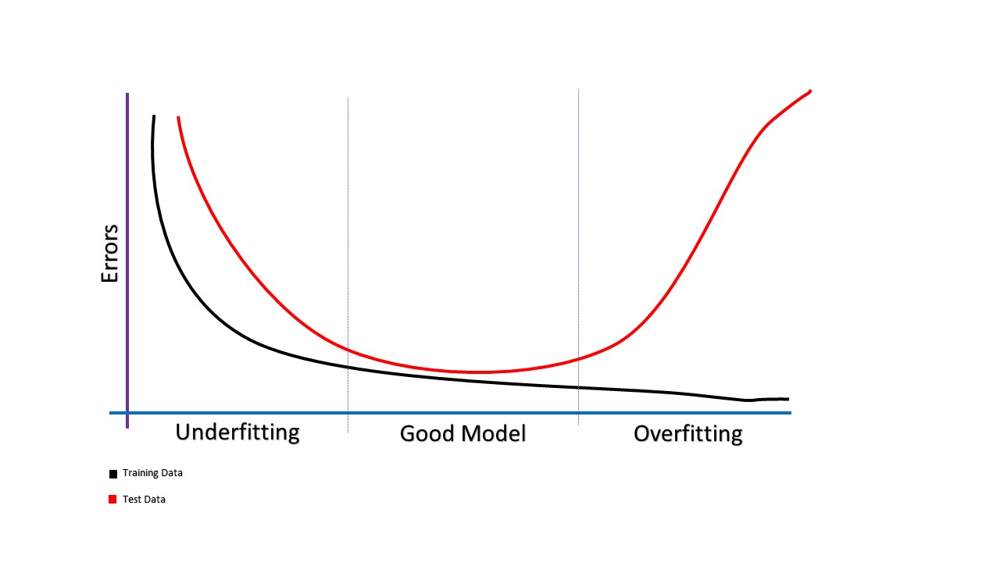
##### _dropout_
##### _early stopping_
##### _cross validation_

---

###accuracy/loss curve noisy
##### _smooth learning rate_
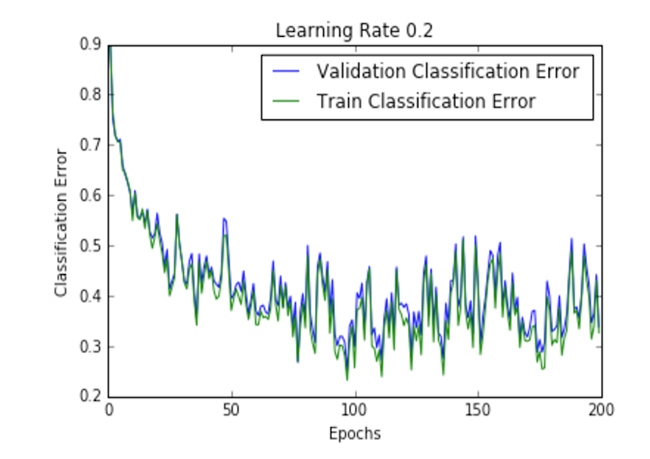
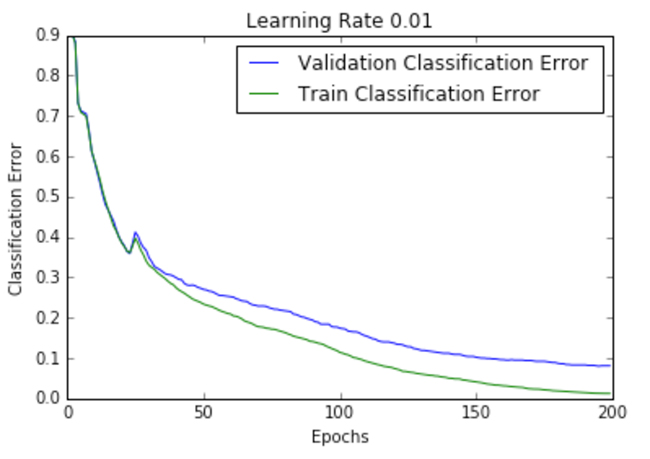

---

#Resources #1
- [Google Machine Learning Crash Course](https://developers.google.com/machine-learning/crash-course/)
- [Learn TensorFlow and deep learning, without a Ph.D. by Martin Görner](https://cloud.google.com/blog/big-data/2017/01/learn-tensorflow-and-deep-learning-without-a-phd)
- [How to Use Metrics for Deep Learning with Keras in Python](https://machinelearningmastery.com/custom-metrics-deep-learning-keras-python/)
- [Neural Networks for Machine Learning course from Coursera](https://www.coursera.org/learn/neural-networks)


---

#Resources #2
- [Machine learning finance](https://medium.com/machine-learning-world/tagged/finance)
- [Keras](https://keras.io)
- [Tensorflow](https://www.tensorflow.org)
- [rucka/deeplearning docker image](https://hub.docker.com/r/rucka/deeplearning/)


---

> It is a capital mistake to theorize before one has data
--  _Sherlock Holmes_


---

#questions?


### _"non ci sono domande stupide, ci sono solo risposte stupide"_

---

#thank *you*!

### slide & code
#### https://github.com/rucka/pycon9
#### https://github.com/rucka/deeplearning_docker


